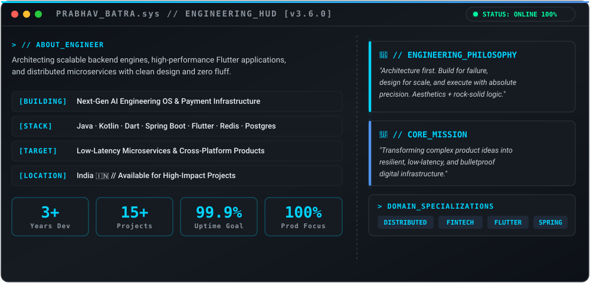

<div align="center">

<!-- Top Animated Header Wave -->


<!-- Main Cyberpunk Tech Keyboard Banner -->
<p align="center">
  
</p>

<!-- Dynamic Typing SVG -->
<a href="https://github.com/Prabhav-Batra">
  
</a>

<br/>

<!-- Profile Shields -->
<p align="center">
  <a href="https://github.com/Prabhav-Batra">
    
  </a>
  <a href="https://github.com/Prabhav-Batra">
    
  </a>
  <a href="https://github.com/Prabhav-Batra">
    
  </a>
</p>

</div>

<p align="center">
  
</p>

<!-- ===================== ABOUT ME ===================== -->
<p align="center">
  
</p>

<p align="center">
  
</p>

<!-- ===================== TECH ARSENAL ===================== -->
<div align="center">

<h2>🛠️ Tech Arsenal</h2>

<p>
  <br/>
  <br/>
  <br/>
  
</p>

</div>

<p align="center">
  
</p>

<!-- ===================== FEATURED PRODUCTS ===================== -->
<h2 align="center">🚀 Featured Engineering Products</h2>

<table width="100%">
<tr>
<td width="50%" valign="top">

```yaml
Name: ProjectOS
Type: AI Engineering Operating System
Tech: Spring Boot, React, Python, OpenAI, PostgreSQL
Status: Production Ready 🟢
Link: https://github.com/Prabhav-Batra/ProjectOS
```
> AI-powered engineering OS automating developer workflows, task orchestration, and intelligent system analytics.

</td>
<td width="50%" valign="top">

```yaml
Name: fluxpay-backend
Type: Payment Gateway & Banking Infra
Tech: Java, Spring Boot, Redis, RabbitMQ, PostgreSQL
Status: Active Deployment 🟢
Link: https://github.com/Prabhav-Batra/fluxpay-backend
```
> High-throughput payment processing engine with double-entry ledger accounting, webhook handling, and fault tolerance.

</td>
</tr>
<tr>
<td width="50%" valign="top">

```yaml
Name: fluxpay-frontend
Type: Mobile Fintech Application
Tech: Flutter, Dart, Riverpod, Firebase, REST
Status: Active Deployment 🟢
Link: https://github.com/Prabhav-Batra/fluxpay-frontend
```
> Sleek, cross-platform mobile wallet and fintech dashboard with real-time transaction streaming and biometric security.

</td>
<td width="50%" valign="top">

```yaml
Name: NIDS_CLI
Type: Network Intrusion Detection CLI
Tech: Python, C++, Scapy, Machine Learning
Status: Open Source 🟢
Link: https://github.com/Prabhav-Batra/NIDS_CLI
```
> Real-time packet inspection and anomaly detection CLI tool leveraging machine learning models to detect network attacks.

</td>
</tr>
<tr>
<td width="50%" valign="top">

```yaml
Name: DiseaseOutbreakPredictor
Type: Predictive Healthcare Analytics
Tech: Python, Scikit-Learn, FastAPI, React
Status: Research & Dev 🟢
Link: https://github.com/Prabhav-Batra/DiseaseOutbreakPredictor
```
> ML forecasting model designed to predict epidemic outbreaks based on epidemiological data, weather patterns, and mobility trends.

</td>
<td width="50%" valign="top">

```yaml
Name: LeetPush
Type: Automation Utility
Tech: JavaScript, Chrome Extension API, GitHub API
Status: Published 🟢
Link: https://github.com/Prabhav-Batra/LeetPush
```
> Lightweight extension automatically syncing accepted LeetCode solutions directly to GitHub repositories with detailed runtime stats.

</td>
</tr>
</table>

<p align="center">
  
</p>

<!-- ===================== GITHUB METRICS ===================== -->
<div align="center">

<h2>📊 GitHub Analytics & Telemetry</h2>

<p align="center">
  
  
</p>

<p align="center">
  
</p>

<p align="center">
  
</p>

</div>


<!-- ===================== CONNECT ===================== -->
<div align="center">

<h2>🌐 Connect & Network</h2>

<p align="center">
  <a href="https://linkedin.com/in/YOUR_USERNAME" target="_blank">
    
  </a>
  <a href="https://your-portfolio.com" target="_blank">
    
  </a>
  <a href="https://instagram.com/YOUR_USERNAME" target="_blank">
    
  </a>
  <a href="mailto:your@email.com">
    
  </a>
</p>

<br/>

<p align="center">
  
</p>

<!-- Footer Wave -->


</div>
