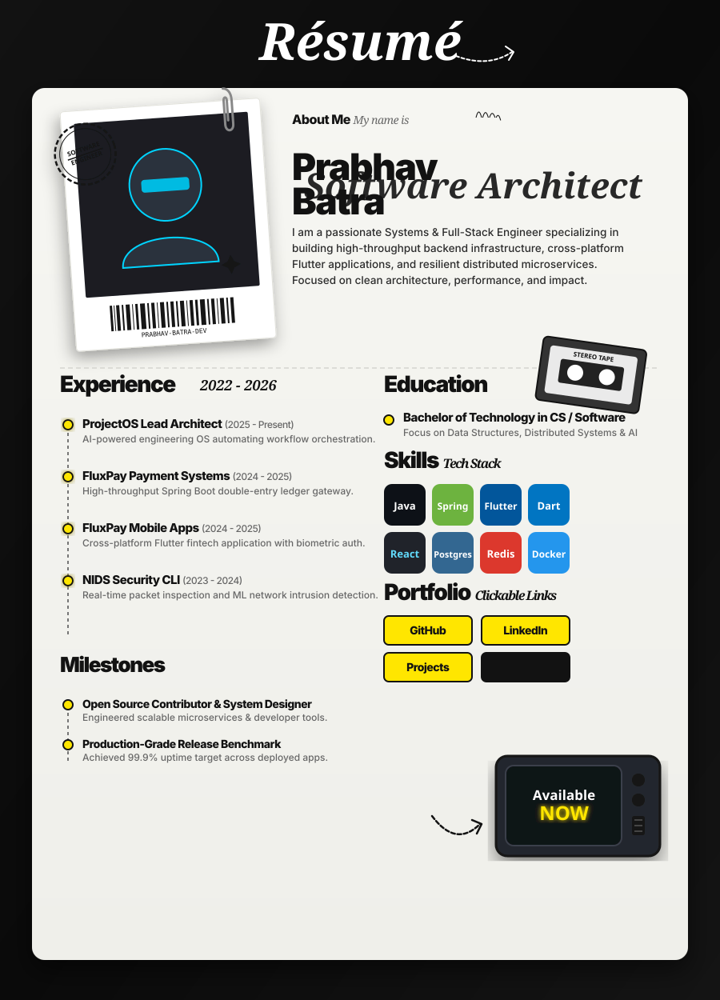

<!-- RETRO EDITORIAL BRUTALIST RESUME POSTER (EXACT MATCH TO REFERENCE DESIGN SYSTEM) -->

  

 

<!-- ===================== QUICK INTERACTIVE LINKS ===================== -->

### 🔗 Connect & Explore

 

<!-- ===================== FEATURED PRODUCTS DETAIL ===================== -->
## 🚀 Featured Engineering Products

<table>
<tr>
<td width="50%" valign="top">

### ⚡ ProjectOS
**Type:** AI Engineering Operating System  
**Tech:** Spring Boot, React, Python, OpenAI, PostgreSQL  
**Link:** [github.com/Prabhav-Batra/ProjectOS](https://github.com/Prabhav-Batra/ProjectOS)  
> Intelligent engineering operating system designed to automate software developer workflows, task orchestration, and system metrics.

</td>
<td width="50%" valign="top">

### 💳 fluxpay-backend
**Type:** Payment Gateway & Ledger Infrastructure  
**Tech:** Java, Spring Boot, Redis, RabbitMQ, PostgreSQL  
**Link:** [github.com/Prabhav-Batra/fluxpay-backend](https://github.com/Prabhav-Batra/fluxpay-backend)  
> High-throughput payment processing engine featuring double-entry ledger accounting, webhook handling, and fault-tolerant queueing.

</td>
</tr>
<tr>
<td width="50%" valign="top">

### 📱 fluxpay-frontend
**Type:** Cross-Platform Mobile Wallet  
**Tech:** Flutter, Dart, Riverpod, Firebase  
**Link:** [github.com/Prabhav-Batra/fluxpay-frontend](https://github.com/Prabhav-Batra/fluxpay-frontend)  
> Sleek, modern mobile fintech application with real-time transaction streaming, biometric security, and ultra-smooth UI animations.

</td>
<td width="50%" valign="top">

### 🛡️ NIDS_CLI
**Type:** Network Intrusion Detection CLI  
**Tech:** Python, C++, Scapy, Machine Learning  
**Link:** [github.com/Prabhav-Batra/NIDS_CLI](https://github.com/Prabhav-Batra/NIDS_CLI)  
> Real-time packet inspection and anomaly detection command-line tool leveraging ML models to detect network attacks.

</td>
</tr>
<tr>
<td width="50%" valign="top">

### 📊 DiseaseOutbreakPredictor
**Type:** Predictive Healthcare Analytics  
**Tech:** Python, Scikit-Learn, FastAPI, React  
**Link:** [github.com/Prabhav-Batra/DiseaseOutbreakPredictor](https://github.com/Prabhav-Batra/DiseaseOutbreakPredictor)  
> Predictive machine learning forecasting model designed to analyze epidemiological data and weather patterns for disease outbreaks.

</td>
<td width="50%" valign="top">

### 🔄 LeetPush
**Type:** Developer Automation Extension  
**Tech:** JavaScript, Chrome Extension API, GitHub API  
**Link:** [github.com/Prabhav-Batra/LeetPush](https://github.com/Prabhav-Batra/LeetPush)  
> Lightweight extension automatically syncing accepted LeetCode solutions directly to GitHub repositories with detailed runtime stats.

</td>
</tr>
</table>

 

<!-- ===================== GITHUB TELEMETRY ===================== -->

## 📊 GitHub Analytics

  
  

  

