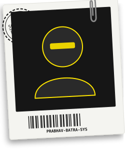

<!-- ===================== BRUTALIST RESUME POSTER (NATIVELY CODED) ===================== -->

<table width="100%" style="border-collapse: collapse; border: none;">
<tr>

<!-- POLAROID AVATAR (LEFT) -->
<td width="35%" align="center" valign="top" style="border: none;">
  
</td>

<!-- HEADER & BIO (RIGHT) -->
<td width="65%" valign="top" style="border: none; padding-left: 20px;">
  
  

    
  
  **ABOUT THE ENGINEER** _Who am I?_
  > I am a passionate **Systems & Full-Stack Engineer** specializing in building high-throughput backend infrastructure, cross-platform Flutter applications, and resilient distributed microservices.
  > 
  > Focused on clean architecture, performance, and impact.
  
   

  **TECH ARSENAL** _Software Used_
    
  <kbd>Java</kbd> <kbd>Kotlin</kbd> <kbd>Spring Boot</kbd> <kbd>Flutter</kbd> <kbd>Dart</kbd>
    
  <kbd>React</kbd> <kbd>PostgreSQL</kbd> <kbd>Redis</kbd> <kbd>Docker</kbd> <kbd>Python</kbd>
  
</td>

</tr>
</table>

<!-- ===================== CAREER TIMELINE ===================== -->
<table width="100%" style="border-collapse: collapse; border: none;">
<tr>

<td width="60%" valign="top" style="border: none; padding-right: 20px;">

## ⚔️ BATTLE-TESTED SYSTEMS

 

🟡 **ProjectOS Lead Architect** _(2025 - Present)_  
> AI-powered engineering OS automating workflow orchestration.
> <kbd>Spring Boot</kbd> <kbd>React</kbd> <kbd>OpenAI</kbd>

 

🟡 **FluxPay Payment Systems** _(2024 - 2025)_  
> High-throughput Spring Boot double-entry ledger gateway.
> <kbd>Java</kbd> <kbd>Redis</kbd> <kbd>RabbitMQ</kbd>

 

🟡 **FluxPay Mobile Apps** _(2024 - 2025)_  
> Cross-platform Flutter fintech application with biometric auth.
> <kbd>Flutter</kbd> <kbd>Dart</kbd> <kbd>Firebase</kbd>

 

🟡 **NIDS Security CLI** _(2023 - 2024)_  
> Real-time packet inspection and ML network intrusion detection.
> <kbd>Python</kbd> <kbd>Scapy</kbd> <kbd>C++</kbd>

</td>

<td width="40%" valign="top" style="border: none;">

## 🏛 FOUNDATION

🟡 **Bachelor of Technology in CS / Software**  
> Focus on Data Structures, Distributed Systems & AI

  

## 🎯 ENGINEERING MILESTONES

🟡 **Open Source Contributor & System Designer**  
> Engineered scalable microservices & developer tools.

 

🟡 **Production-Grade Release Benchmark**  
> Achieved 99.9% uptime target across deployed apps.

</td>

</tr>
</table>

<!-- ===================== DEPLOYMENT LINKS & RETRO WIDGET ===================== -->
<table width="100%" style="border-collapse: collapse; border: none;">
<tr>

<td width="60%" valign="top" style="border: none;">

## 🔗 DEPLOYMENT LINKS _Click to Access_

 

   

### 📡 TELEMETRY

</td>

<td width="40%" align="right" valign="bottom" style="border: none;">

</td>

</tr>
</table>
