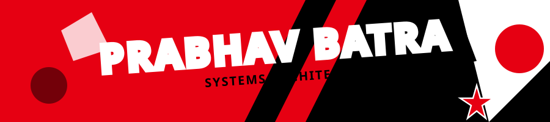

<table width="100%" style="border-collapse: collapse; border: none; background-color: #0d1117; color: #c9d1d9;">
<tr>

<!-- LEFT COLUMN: Profile & Contact -->
<td width="25%" align="left" valign="top" style="padding: 20px; border-right: 1px solid #30363d;">
  
  

    <!-- Circular Avatar -->
    
      
    <h2 style="margin: 0; color: #FFFFFF;">Prabhav Batra</h2>
    
Systems Architect

    
Building scalable infrastructure

  

   
  
  

    📍 New Delhi, India  
    ✉️ <a href="mailto:your@email.com" style="color: #E60012; text-decoration: none;">prabhav@example.com</a>  
    🔗 <a href="https://linkedin.com/in/YOUR_USERNAME" style="color: #E60012; text-decoration: none;">linkedin.com/in/prabhav</a>  
    🌐 <a href="https://your-portfolio.com" style="color: #E60012; text-decoration: none;">portfolio.com</a>
  

   

  <h3 style="color: #FFFFFF;">Achievements</h3>
  

</td>

<!-- RIGHT COLUMN: Main Content -->
<td width="75%" valign="top" style="padding: 20px;">

  <!-- Banner -->
  
  
    
  
  <!-- Red Badges -->
  

    
    
    
  

    

  <!-- About Section with Hat -->
  <table width="100%" style="border-collapse: collapse; border: none;">
    <tr>
      <td width="40%" align="center" valign="middle">
        
      </td>
      <td width="60%" valign="top">
        
Who Am I?

        

          I am a <strong>Systems & Full-Stack Engineer</strong> currently focusing on building high-throughput backend infrastructure, cross-platform Flutter applications, and resilient distributed microservices. My professional journey is driven by continuous learning, practical experience, and a strong commitment to delivering complete and functional systems for real-world needs.
            
          Over time, I have developed solid experience across the <strong>backend development ecosystem</strong>, where logic meets scalability. Alongside web technologies, I have expanded my skills into mobile development, focusing on building modern applications using <strong>Flutter and React Native</strong>.
        

      </td>
    </tr>
  </table>

   

  <!-- Connect Buttons -->
  

    
You can Click here

    
    
    
  

    

  <!-- Caution Block -->
  <table width="100%" style="border-collapse: collapse; border: 1px solid #30363d; border-radius: 8px;">
    <tr>
      <td width="85%" style="padding: 20px;">
        <h3 style="color: #E60012; margin-top: 0;">🔴 Caution</h3>
        

          Code is never finished, it only gets better.  
          What you see here is built with practice, curiosity, and persistence.
        

      </td>
      <td width="15%" align="center">
        
      </td>
    </tr>
  </table>

    

  <!-- System Telemetry (Contributions) -->
  

    
      
    <!-- Dark themed red graph -->
    
  

    

  <!-- Tech Arsenal and Projects -->
  <table width="100%" style="border-collapse: collapse; border: none;">
    <tr>
      
      <!-- Left: Tech Stack -->
      <td width="50%" valign="top" align="center" style="padding-right: 10px;">
        
          
        
          
        
          
        
      </td>

      <!-- Right: Battle Tested Systems (Projects) -->
      <td width="50%" valign="top" align="center" style="padding-left: 10px;">
        
          
        
          
        
      </td>

    </tr>
  </table>
  
    
  
  <!-- Streaks -->
  

    
  

</td>
</tr>
</table>

